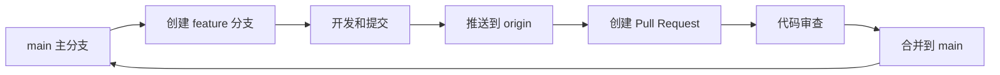
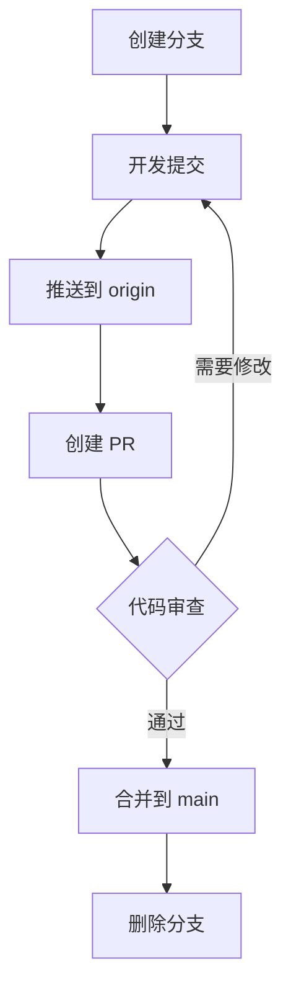

# 贡献指南

感谢您对本项目的关注！本文档提供了 Git 操作指南、提交规范和贡献流程。

## 目录

- [快速开始](#快速开始)
- [Git 工作流程](#git-工作流程)
- [提交规范](#提交规范)
- [分支管理策略](#分支管理策略)
- [Pull Request 流程](#pull-request-流程)
- [代码审查清单](#代码审查清单)
- [常见问题](#常见问题)

## 快速开始

### 1. Fork 和克隆项目

```bash
# Fork 项目到你的 GitHub 账户（在 GitHub 网页操作）

# 克隆你 Fork 的仓库
git clone https://github.com/YOUR_USERNAME/Terraform-Cloud.git
cd Terraform-Cloud

# 添加上游仓库
git remote add upstream https://github.com/ORIGINAL_OWNER/Terraform-Cloud.git

# 验证远程仓库
git remote -v
# 输出应该包含：
# origin    https://github.com/YOUR_USERNAME/Terraform-Cloud.git (fetch)
# origin    https://github.com/YOUR_USERNAME/Terraform-Cloud.git (push)
# upstream  https://github.com/ORIGINAL_OWNER/Terraform-Cloud.git (fetch)
# upstream  https://github.com/ORIGINAL_OWNER/Terraform-Cloud.git (push)
```

### 2. 同步主分支

```bash
# 切换到主分支
git checkout main

# 拉取上游仓库的最新更改
git fetch upstream

# 合并上游更改到本地主分支
git merge upstream/main

# 推送到你的 Fork
git push origin main
```

## Git 工作流程

我们采用 **Feature Branch Workflow**（特性分支工作流）：



### 工作流程详解

1. **创建功能分支**
   ```bash
   # 确保主分支是最新的
   git checkout main
   git pull upstream main

   # 创建并切换到新的功能分支
   git checkout -b feature/add-vpc-module
   ```

2. **开发和提交**
   ```bash
   # 查看文件状态
   git status

   # 添加文件到暂存区
   git add <file1> <file2>
   # 或添加所有更改
   git add .

   # 提交更改（遵循提交规范）
   git commit -m "feat(aws): add VPC module with NAT gateway"
   ```

3. **保持分支同步**
   ```bash
   # 定期同步上游主分支的更新
   git fetch upstream
   git rebase upstream/main

   # 如果有冲突，解决冲突后：
   git add <resolved-files>
   git rebase --continue
   ```

4. **推送到远程仓库**
   ```bash
   # 首次推送
   git push origin feature/add-vpc-module

   # 如果之前已经推送过，并且做了 rebase
   git push origin feature/add-vpc-module --force-with-lease
   ```

5. **创建 Pull Request**
   - 在 GitHub 网页上创建 Pull Request
   - 填写 PR 描述（参考 PR 模板）
   - 等待代码审查

## 提交规范

我们使用 **Conventional Commits** 规范，这有助于：
- 自动生成 CHANGELOG
- 语义化版本控制
- 快速理解提交目的

### 提交消息格式

```
<type>(<scope>): <subject>

<body>

<footer>
```

### Type（类型）

必须是以下之一：

| Type | 描述 | 示例 |
|------|------|------|
| `feat` | 新功能 | `feat(aws): add RDS database module` |
| `fix` | Bug 修复 | `fix(aws): resolve ASG destroy timeout issue` |
| `docs` | 文档更新 | `docs: update AWS deployment guide` |
| `style` | 代码格式（不影响代码运行） | `style: format terraform files` |
| `refactor` | 代码重构 | `refactor(aws): simplify security group rules` |
| `perf` | 性能优化 | `perf(aws): optimize ALB health check interval` |
| `test` | 测试相关 | `test(aws): add integration tests for blue-green` |
| `build` | 构建系统或依赖更新 | `build: update terraform to 1.6.0` |
| `ci` | CI/CD 配置 | `ci: add GitHub Actions workflow` |
| `chore` | 其他杂项 | `chore: update .gitignore` |
| `revert` | 回退提交 | `revert: revert feat(aws): add VPC module` |

### Scope（范围）

指明提交影响的范围，可选但推荐使用：

- `aws` - AWS 相关
- `rds` - RDS 模块
- `blue-green` - 蓝绿部署模块
- `docs` - 文档
- `security` - 安全相关
- `*` - 影响多个范围

### Subject（主题）

- 使用祈使句，现在时："add" 而不是 "added" 或 "adds"
- 不要首字母大写
- 不要以句号结尾
- 限制在 50 个字符以内

### Body（正文）

可选，提供详细的提交说明：
- 解释**为什么**做这个更改
- 描述**如何**解决问题
- 提及任何**副作用**

### Footer（页脚）

可选，用于：
- 引用相关 Issue: `Closes #123`
- 说明破坏性变更: `BREAKING CHANGE: ...`

### 提交示例

#### 简单提交

```bash
git commit -m "feat(aws): add S3 bucket encryption"
```

#### 详细提交

```bash
git commit -m "feat(aws/rds): add Multi-AZ support for PostgreSQL

- Enable automatic failover for production databases
- Configure backup retention to 30 days
- Add CloudWatch alarms for database metrics

Closes #45"
```

#### 破坏性变更

```bash
git commit -m "feat(aws): migrate to Terraform 1.6

BREAKING CHANGE: Minimum Terraform version is now 1.6.0.
Please upgrade your Terraform installation before pulling this change."
```

## 分支管理策略

### 分支类型

```
main                    # 主分支（受保护）
├── feature/*           # 功能开发分支
├── fix/*               # Bug 修复分支
├── docs/*              # 文档更新分支
├── refactor/*          # 代码重构分支
└── release/*           # 发布分支（可选）
```

### 分支命名规范

- **功能分支**: `feature/short-description`
  - 示例: `feature/add-vpc-module`
  - 示例: `feature/aws-cloudwatch-integration`

- **修复分支**: `fix/short-description`
  - 示例: `fix/asg-timeout-issue`
  - 示例: `fix/rds-password-rotation`

- **文档分支**: `docs/short-description`
  - 示例: `docs/update-readme`
  - 示例: `docs/add-architecture-diagram`

- **重构分支**: `refactor/short-description`
  - 示例: `refactor/simplify-networking`
  - 示例: `refactor/consolidate-variables`

### 分支生命周期



1. **创建分支**: 从最新的 `main` 分支创建
2. **开发**: 在分支上进行开发和提交
3. **推送**: 推送到你的 Fork（origin）
4. **Pull Request**: 创建 PR 请求合并到上游 `main`
5. **代码审查**: 等待维护者审查
6. **合并**: 审查通过后合并到 `main`
7. **清理**: 删除已合并的分支

### 删除已合并的分支

```bash
# 本地删除分支
git branch -d feature/add-vpc-module

# 远程删除分支
git push origin --delete feature/add-vpc-module

# 清理本地已删除的远程跟踪分支
git fetch --prune
```

## Pull Request 流程

### 1. 创建 Pull Request

在 GitHub 网页上创建 PR 时，请提供清晰的描述：

```markdown
## 描述
简要说明此 PR 的目的和改动内容。

## 变更类型
- [ ] 新功能（feat）
- [ ] Bug 修复（fix）
- [ ] 文档更新（docs）
- [ ] 代码重构（refactor）
- [ ] 其他（请说明）

## 改动内容
- 添加了 VPC 模块
- 配置了 NAT Gateway
- 更新了相关文档

## 测试
- [ ] 已运行 `terraform validate`
- [ ] 已运行 `terraform plan`
- [ ] 已在测试环境验证
- [ ] 已更新文档

## 相关 Issue
Closes #123

## 屏幕截图（如适用）
（粘贴相关截图）
```

### 2. 代码审查

等待项目维护者审查你的代码。审查者可能会：
- 提出修改建议
- 要求补充测试
- 要求更新文档

### 3. 响应反馈

根据审查意见修改代码：

```bash
# 修改代码后提交
git add .
git commit -m "fix: address review comments"

# 推送更新
git push origin feature/add-vpc-module
```

### 4. 合并

审查通过后，维护者会合并你的 PR：
- 使用 **Squash and Merge** 保持主分支历史清晰
- 或使用 **Rebase and Merge** 保留所有提交

### 5. 清理

PR 合并后，清理本地和远程分支：

```bash
# 同步主分支
git checkout main
git pull upstream main

# 删除本地功能分支
git branch -d feature/add-vpc-module

# 删除远程功能分支
git push origin --delete feature/add-vpc-module
```

## 代码审查清单

在提交 Pull Request 之前，请确保：

### Terraform 代码质量

- [ ] 代码已格式化
  ```bash
  terraform fmt -recursive
  ```

- [ ] 配置已验证
  ```bash
  terraform validate
  ```

- [ ] 变量有适当的描述和类型
  ```hcl
  variable "instance_type" {
    description = "EC2 instance type"
    type        = string
    default     = "t3.micro"
  }
  ```

- [ ] 敏感输出已标记
  ```hcl
  output "database_password" {
    description = "Database master password"
    value       = random_password.db_password.result
    sensitive   = true
  }
  ```

### 安全性

- [ ] 没有硬编码凭证或密码
- [ ] 敏感信息使用 AWS Secrets Manager 或 SSM Parameter Store
- [ ] `terraform.tfvars` 未被提交
- [ ] `*.tfstate` 文件未被提交
- [ ] Security Group 规则遵循最小权限原则

### 文档

- [ ] 更新了 README.md（如果需要）
- [ ] 添加了变量说明
- [ ] 添加了输出说明
- [ ] 提供了使用示例
- [ ] 更新了架构图（如果需要）

### 测试

- [ ] 在开发环境测试了 `terraform plan`
- [ ] 在开发环境测试了 `terraform apply`
- [ ] 验证了资源创建成功
- [ ] 测试了 `terraform destroy`
- [ ] 资源能够正确销毁

### Git 规范

- [ ] 提交消息遵循 Conventional Commits 规范
- [ ] 分支名称符合命名规范
- [ ] 没有合并冲突
- [ ] PR 描述清晰完整

## 常见问题

### Q1: 如何解决合并冲突？

```bash
# 1. 同步上游主分支
git fetch upstream
git checkout main
git merge upstream/main

# 2. 切换到功能分支并 rebase
git checkout feature/add-vpc-module
git rebase main

# 3. 解决冲突
# 编辑冲突文件，解决冲突标记

# 4. 标记为已解决
git add <resolved-files>

# 5. 继续 rebase
git rebase --continue

# 6. 强制推送（谨慎使用）
git push origin feature/add-vpc-module --force-with-lease
```

### Q2: 如何修改最后一次提交？

```bash
# 修改文件后
git add <files>

# 修改最后一次提交（不创建新提交）
git commit --amend

# 如果只修改提交消息
git commit --amend -m "feat(aws): improved commit message"

# 推送修改（如果已推送过）
git push origin feature/add-vpc-module --force-with-lease
```

### Q3: 如何撤销本地更改？

```bash
# 撤销工作区的更改（未 add）
git checkout -- <file>

# 撤销暂存区的更改（已 add 未 commit）
git reset HEAD <file>

# 撤销最后一次提交（保留更改）
git reset --soft HEAD~1

# 撤销最后一次提交（丢弃更改）
git reset --hard HEAD~1
```

### Q4: 如何临时保存工作进度？

```bash
# 保存当前工作进度
git stash

# 查看 stash 列表
git stash list

# 恢复最近的 stash
git stash pop

# 恢复指定的 stash
git stash apply stash@{0}

# 删除 stash
git stash drop stash@{0}
```

### Q5: 如何查看提交历史？

```bash
# 查看简洁的提交历史
git log --oneline

# 查看带分支图的历史
git log --oneline --graph --all

# 查看某个文件的历史
git log --follow <file>

# 查看某次提交的详情
git show <commit-hash>
```

### Q6: 如何重命名分支？

```bash
# 重命名当前分支
git branch -m new-branch-name

# 重命名其他分支
git branch -m old-branch-name new-branch-name

# 删除远程旧分支并推送新分支
git push origin --delete old-branch-name
git push origin new-branch-name
git push origin -u new-branch-name
```

## Git 配置建议

### 配置用户信息

```bash
# 全局配置
git config --global user.name "Your Name"
git config --global user.email "your.email@example.com"

# 项目级配置（仅当前仓库）
git config user.name "Your Name"
git config user.email "your.email@example.com"
```

### 有用的 Git 别名

```bash
# 添加常用别名
git config --global alias.st status
git config --global alias.co checkout
git config --global alias.br branch
git config --global alias.ci commit
git config --global alias.unstage 'reset HEAD --'
git config --global alias.last 'log -1 HEAD'
git config --global alias.lg "log --color --graph --pretty=format:'%Cred%h%Creset -%C(yellow)%d%Creset %s %Cgreen(%cr) %C(bold blue)<%an>%Creset' --abbrev-commit"

# 使用别名
git st           # 等同于 git status
git lg           # 美化的提交历史
```

### 启用自动补全和提示

```bash
# 对于 Bash（macOS/Linux）
# 添加到 ~/.bashrc 或 ~/.bash_profile
if [ -f /usr/local/etc/bash_completion ]; then
  . /usr/local/etc/bash_completion
fi

# 对于 Zsh（macOS/Linux）
# 添加到 ~/.zshrc
autoload -Uz compinit && compinit
```

## 资源链接

- **Git 官方文档**: https://git-scm.com/doc
- **Conventional Commits**: https://www.conventionalcommits.org/
- **GitHub Flow**: https://guides.github.com/introduction/flow/
- **Pro Git 书籍**: https://git-scm.com/book/zh/v2

## 获取帮助

如果你在贡献过程中遇到问题：

1. 查看本文档的常见问题部分
2. 在 GitHub Issues 中搜索类似问题
3. 创建新的 Issue 寻求帮助
4. 联系项目维护者

感谢你的贡献！

---

**最后更新**: 2025-12-31
**维护者**: iKelvinLab
