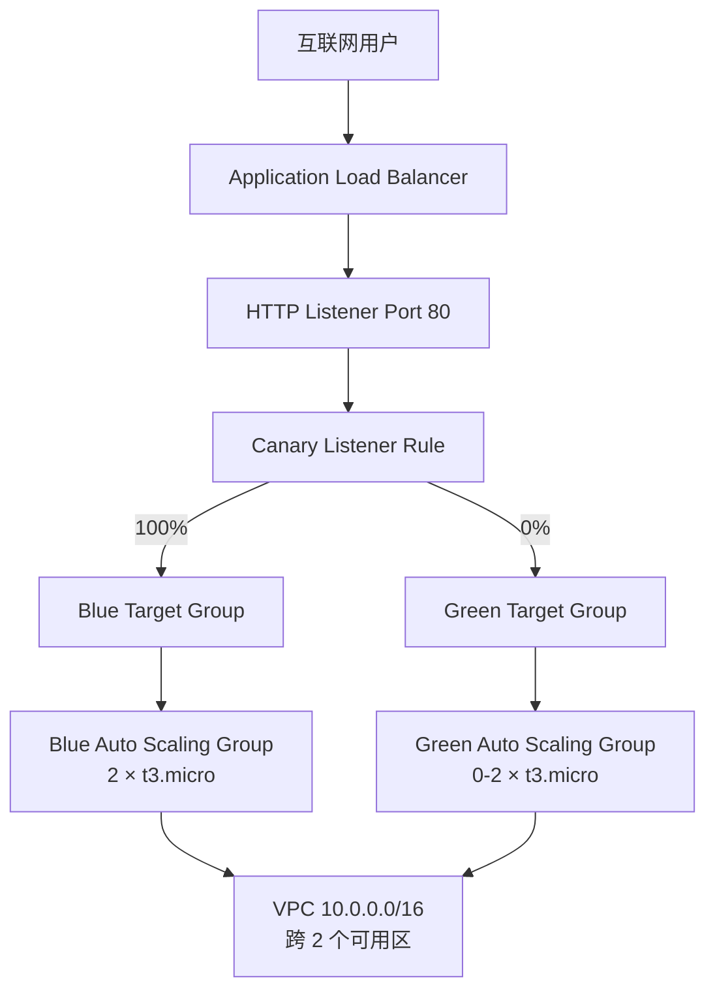

# Terraform Cloud Infrastructure

使用 Terraform 管理多云平台的基础设施资源，实现声明式配置、版本控制和自动化部署。

## 项目概述

本项目提供了一套完整的 Terraform 配置，用于管理和部署云基础设施，支持多云平台和多环境部署策略。

### 核心特性

- **多云支持** - AWS、阿里云、腾讯云等主流云平台
- **蓝绿部署** - 零停机更新，支持灰度发布和快速回滚
- **模块化设计** - 可复用的 Terraform 模块，便于维护和扩展
- **安全最佳实践** - 敏感信息保护，状态文件加密，最小权限原则
- **完整文档** - 详细的部署指南、架构说明和最佳实践

## 项目结构

```
Terraform-Cloud/
├── README.md                # 项目总览（本文件）
├── CONTRIBUTING.md          # Git 操作和贡献指南
├── TERRAFORM_GUIDE.md       # Terraform 使用指南
├── .gitignore               # Git 忽略规则
│
├── AWS/                     # AWS 云平台配置
│   ├── blue-green/          # 蓝绿部署模块
│   │   ├── README.md        # 模块文档
│   │   ├── *.tf             # Terraform 配置
│   │   └── docs/            # 详细文档
│   │
│   └── rds/                 # RDS 数据库模块
│       ├── README.md        # 模块文档
│       ├── *.tf             # Terraform 配置
│       └── docs/            # 详细文档
│
└── (其他云平台目录)
    ├── AliCloud/            # 阿里云配置
    ├── TencentCloud/        # 腾讯云配置
    └── GCP/                 # Google Cloud 配置
```

## 快速开始

### 前置要求

1. **安装 Terraform** (>= 1.0)
   ```bash
   brew install terraform
   terraform version
   ```

2. **配置云平台凭证**
   ```bash
   # AWS 示例
   aws configure
   ```

3. **克隆项目**
   ```bash
   git clone <repository-url>
   cd Terraform-Cloud
   ```

### 基本使用

```bash
# 进入具体模块目录
cd AWS/blue-green/

# 初始化 Terraform
terraform init

# 查看执行计划
terraform plan

# 应用配置
terraform apply

# 销毁资源
terraform destroy
```

详细操作请参阅 [Terraform 使用指南](TERRAFORM_GUIDE.md)。

## 可用模块

### AWS 模块

#### 1. Blue-Green 部署
- **位置**: `/AWS/blue-green/`
- **功能**: 零停机的蓝绿部署架构
- **特性**: ALB、ASG、灰度发布、快速回滚
- **文档**: [AWS/blue-green/README.md](AWS/blue-green/README.md)

#### 2. RDS 数据库
- **位置**: `/AWS/rds/`
- **功能**: 托管关系型数据库
- **特性**: Multi-AZ、自动备份、性能监控、安全加密
- **文档**: [AWS/rds/README.md](AWS/rds/README.md)

## 架构示例

### AWS 蓝绿部署架构



## 文档导航

- **[README.md](README.md)** - 项目概述（本文件）
- **[CONTRIBUTING.md](CONTRIBUTING.md)** - Git 操作指南和贡献规范
- **[TERRAFORM_GUIDE.md](TERRAFORM_GUIDE.md)** - Terraform 使用指南和最佳实践

### 模块文档

- **AWS Blue-Green**: [AWS/blue-green/README.md](AWS/blue-green/README.md)
- **AWS RDS**: [AWS/rds/README.md](AWS/rds/README.md)

## 安全注意事项

- 绝不提交 `terraform.tfvars` 文件（可能包含敏感信息）
- 绝不提交 `*.tfstate` 文件（包含完整基础设施状态）
- 使用环境变量或 AWS CLI 配置管理凭证
- 生产环境使用远程状态后端（S3 + DynamoDB）
- 参考 `.gitignore` 了解被忽略的文件

详细安全指南请参阅 [TERRAFORM_GUIDE.md](TERRAFORM_GUIDE.md)。

## 贡献指南

我们欢迎所有形式的贡献！请阅读 [CONTRIBUTING.md](CONTRIBUTING.md) 了解：

- Git 工作流程
- 提交规范（Commit Message Conventions）
- 分支管理策略
- Pull Request 流程
- 代码审查清单

## 支持和反馈

- **文档问题**: 请查阅各模块的 README 和详细文档
- **Bug 报告**: 在 GitHub Issues 中提交问题
- **功能建议**: 欢迎提交 Issue 或 Pull Request

## 许可证

本项目采用开源许可证，具体信息请参阅 LICENSE 文件。

---

**项目维护**: iKelvinLab
**最后更新**: 2025-12-31
**Terraform 版本**: >= 1.0
